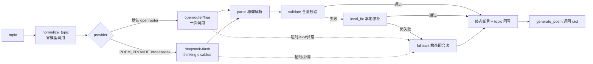

# 五言古诗生成系统

输入任意 `topic`（中文、英文、数字、空串、emoji、超长文本均可），返回一首
四句五言古诗。系统对“格式 + 字数 + 韵脚”给出 100% 保证：模型只负责提出
候选，解析、校验、韵脚判断、失败恢复和最终输出由本地代码裁决。

```json
{
  "topic": "月色",
  "title": "月夜灯",
  "lines": ["明月照寒窗", "孤灯映夜长", "客梦落寒霜", "清影落池塘"]
}
```

## 快速开始

```bash
git clone https://github.com/StellarEcho/ancient-poem-generator.git
cd ancient-poem-generator
python3 -m venv .venv
source .venv/bin/activate
pip install -r requirements.txt

# 提交验收默认 provider（OpenRouter 免费路由）
export OPENROUTER_API_KEY=你的Key

# 或：DeepSeek flash 显式测试通道
export POEM_PROVIDER=deepseek
export DEEPSEEK_API_KEY=你的Key
export DEEPSEEK_THINKING=disabled
```

不配置任何 Key 也能运行：系统会静默走本地确定性兜底。

## 运行 Pipeline



执行逻辑：

1. **normalize_topic**：纯本地把 topic 映射为意象、情绪、标题提示和禁用词，
   不调用模型；英文、年份、节日、四君子、山水情感等都有字典。
2. **模型生成**：最多 1 次调用，不重试。默认 `openrouter/free`；显式
   `POEM_PROVIDER=deepseek` 时使用唯一模型 `deepseek-flash`，并通过
   `{"thinking": {"type": "disabled"}}` 关闭思考模式。
3. **parse**：按“整段 JSON → 最外层 `{}` → 连续四行五字”逐级降级，
   不信任模型原始文本。
4. **validate**：校验 title 2–8 字、四句、每句五字、纯汉字、第 1/3 句
   韵母严格相等；返回结构化错误码。
5. **local_fix**：只救小毛病；韵脚失败时先用人工校对的同韵整句替换第 3
   句，再退到白名单尾词替换。
6. **fallback**：24 组五言句料 + 50 余条通用第 3 句白名单，构造时就满足
   结构/汉字/韵脚；用 blake2s 稳定种子保证同 topic 可复现。
7. **终态断言**：返回前再全量校验一次；`topic` 始终由 Harness 写回原始
   输入，模型改写无效。

运行预算：客户端 15s 硬超时（含看门狗，兜住卡死的 SSL read），
`POEM_OFFLINE=1`、无 Key、429、异常、输出不合格都会收口到同一个兜底。

## 模块

| 文件 | 职责 |
| --- | --- |
| `poem_system/api.py` | 对外接口 `generate_poem(topic) -> dict` |
| `poem_system/harness.py` | 单线流程：生成 → 解析 → 修复 → 兜底 → 断言 |
| `poem_system/normalize.py` | topic → PoemBrief（意象/情绪/标题提示/禁用词） |
| `poem_system/client.py` | OpenRouter / DeepSeek flash 客户端，硬超时看门狗 |
| `poem_system/parse.py` | 从 JSON、markdown、散文里提取候选诗 |
| `poem_system/validate.py` | 结构、汉字、字数、重复句警告、错误码 |
| `poem_system/rhyme.py` | `pypinyin Style.FINALS strict=True` 严格韵脚 |
| `poem_system/local_fix.py` | 零模型本地修补 |
| `poem_system/fallback.py` | 构造即合法的确定性兜底与句料库 |
| `poem_system/cli.py` | 命令行入口（单条/多条/离线/verbose） |
| `scripts/run_free_route_experiment.py` | 批量采样脚本（支持两种 provider） |
| `scripts/batch_generate.py` | 测试者批量调用 `generate_poem` 的示例脚本 |

## Provider 与环境变量

| 变量 | 说明 |
| --- | --- |
| `POEM_PROVIDER` | `openrouter`（默认，提交验收）或 `deepseek` |
| `OPENROUTER_API_KEY` | 默认 provider 的 Key |
| `DEEPSEEK_API_KEY` | DeepSeek provider 的 Key |
| `DEEPSEEK_THINKING` | 默认 `disabled`，关闭 DeepSeek 思考模式 |
| `DEEPSEEK_MAX_TOKENS` | DeepSeek 最大输出 token，默认 1024 |
| `POEM_OFFLINE` | `1` 时强制本地兜底 |
| `POEM_DEBUG` | `1` 时把运行记录写入 `artifacts/runs/` |

不要提交任何真实 Key；示例见 [.env.example](.env.example)。

## 测试

### 离线测试（默认，不需要网络）

```bash
python -m pytest -q
```

当前结果：**188 passed，10 deselected**（网络用例默认跳过）。覆盖：

- 严谨的韵脚测试向量（窗/霜、光/廊、天/安、秋/愁、月/色 等）
- title 字数、四句、五字、标点/空格/数字/英文/注音/扩展区字符
- 31 类常用中文 topic + 英文/数字/空串/emoji/超长文本/代理字符
- 解析降级、本地修补、重复句质量警告
- 假客户端故障矩阵（429/超时/空响应/错误 JSON/五句/六字句等）
- 100 个随机 topic 的 fuzz 合规属性测试

### 真实模型网络测试（显式开启）

```bash
# DeepSeek flash
POEM_PROVIDER=deepseek python -m pytest -m network -q -s

# OpenRouter（免费额度：约 50 次/天，08:00 重置）
POEM_PROVIDER=openrouter python -m pytest -m network -q -s
```

DeepSeek flash 最近一次 10-topic E2E：10/10 全部走模型，单条约 1–2 秒。

### 批量实验与结果位置

```bash
# DeepSeek flash；先小批量建议加 --max-runs 12
POEM_PROVIDER=deepseek python scripts/run_free_route_experiment.py \
    --repeats 2 --concurrency 3 --timeout 20
```

结果为本地文件（已 gitignore）：

```text
artifacts/experiments/free_route_<timestamp>/
  runs.jsonl     每次运行：topic/provider/model/原始输出/失败分类/延迟/token
  summary.json   聚合指标
  summary.md     人读报告
```

已有实验结论固定在
[experiments/FREE_ROUTE_FINDINGS.md](experiments/FREE_ROUTE_FINDINGS.md)：

| 批次 | 结果 |
| --- | --- |
| OpenRouter 72 次 | 20 次走模型，52 次兜底；超时 23、429 16 |
| OpenRouter 配额耗尽后 72 次 | 全部 429，约 0.5s 快速兜底 |
| DeepSeek flash 最终 72 次 | **72/72 全部走模型，0 兜底**；p50 0.92s、p90 1.18s、平均 214 token |

累计 6 批 × 72 次批量实验 + 网络 E2E：**最终输出合规率 100%**。

## CLI

```bash
# 单条（默认 provider）
python -m poem_system.cli 月色

# 多条
python -m poem_system.cli --topics 月色 "Mars Return" "AI时代的孤独"

# 强制离线
python -m poem_system.cli --offline 月色

# 打印 source/calls/latency/errors
python -m poem_system.cli --verbose 月色

# 显式使用 DeepSeek flash
POEM_PROVIDER=deepseek python -m poem_system.cli 月色
```

退出码：`0` = 合规，`1` = 不合规（正常不应出现），`2` = 参数错误。

## 通过 generate_poem 调用

```python
from poem_system import generate_poem

poem = generate_poem("月色")
print(poem)
```

```bash
python -c "from poem_system import generate_poem; print(generate_poem('月色'))"
```

批量测试可直接用
[scripts/batch_generate.py](scripts/batch_generate.py)：

```bash
# 传 topic，逐条打印 JSON 并本地复检
python scripts/batch_generate.py 月色 "Mars Return" "2026年的第一场雪"

# 每个 topic 重复 2 次，写入 JSONL
POEM_PROVIDER=deepseek python scripts/batch_generate.py \
    --repeat 2 --output results.jsonl 月色 梅花 黄昏

# 从文件读取 topic（每行一个）
python scripts/batch_generate.py --topics-file topics.txt --output results.jsonl

# 完全离线
python scripts/batch_generate.py --offline --topics-file topics.txt
```

脚本对每次返回都跑全量校验，stderr 输出汇总：

```text
# total=6 valid=6 invalid=0 topics=3 provider=deepseek offline=False elapsed=9.42s
```

## 项目结构

```text
ancient_poem/
├── README.md
├── PLAN.md                     # 设计与决策记录
├── requirements.txt            # pypinyin + certifi
├── pytest.ini                  # 默认排除 network 用例
├── .env.example                # 环境变量模板（无真实 Key）
├── poem_system/                # 系统实现
├── scripts/
│   ├── batch_generate.py       # 批量测试示例
│   └── run_free_route_experiment.py
├── experiments/
│   └── FREE_ROUTE_FINDINGS.md  # 实验结论（已提交）
├── tests/                      # 188 项离线测试 + 10 项网络测试
└── artifacts/                  # 运行/实验原始数据（本地，gitignore）
```

## 安全与边界

- 仓库不含任何真实 Key；`.env*`、`*.key`、`*.pem`、`secrets/` 已忽略；
- `topic` 永远原样回写，模型无法改写为“雅题”；
- 模型输出永不直接返回，必须通过本地校验；
- 不重试、不无限等待：失败即兜底，保证始终合法。
