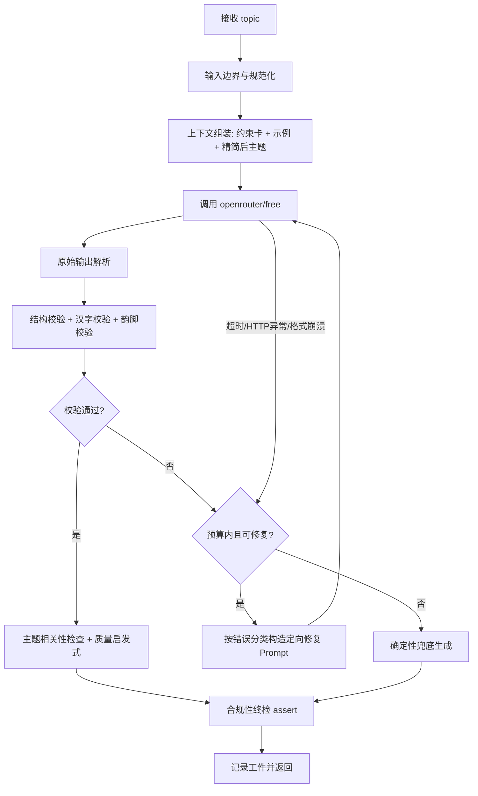

# 五言古诗生成系统 — Agent Harness 实施计划

> 依据《初面-实战题.pdf》设计。目标不是“调一次 LLM”，而是构建一个以 LLM 为
> “受控生成组件”、以 Harness 为“监督者”的完整系统：模型输出永不直接可信，
> 任何一次运行最终都返回 100% 合规的 `dict`。

## 1. 验收目标（Definition of Success）

对任意 `topic: str`，`generate_poem(topic) -> dict` 必须：

1. 返回格式固定：
   `{"topic": <原样输入>, "title": str, "lines": list[str]}`。
2. `title` 为 2–8 个汉字。
3. `lines` 恰好 4 句，每句恰好 5 个汉字。
4. 标题与诗句不含标点、空格、数字、英文字母或任何非汉字字符。
5. 第 1 句与第 3 句末字普通话韵母相同（忽略声调）。
6. 在 API 超时、限流、返回乱码、返回不合格内容等任何情况下仍满足 1–5。
7. 在此之上追求切题、连贯、有诗意的结果，并控制延迟与 Token 成本。

质量与效率的可观测指标：

- 合规率 = 100%（测试与模糊测试共同验证）。
- 端到端延迟：优先 p50/p90 优化，总量受预算上限约束。
- 平均模型调用次数尽量接近 1 次/诗；非必要不做第二次生成。
- 原始输出 + 修复过程 + 最终产物全部落入运行工件。

## 2. 总体架构

### 2.1 角色划分

系统不是“自由 Agent”，而是“Harness 监督下的受限生成者”：

| 角色 | 组件 | 职责 |
| --- | --- | --- |
| 监督者（Harness） | Runtime + 校验器 | 编排流程、设预算、做最终裁决 |
| 工人（Worker） | OpenRouter `openrouter/free` | 一次性提交候选诗，不负责正确性 |
| 工具层（Tools） | Validator / Rhyme / Parser / Repair | 纯函数、可单测、可审计 |
| 兜底者（Fallback） | 确定性生成器 | 零模型依赖，保证 100% 底线 |
| 记录员（Recorder） | Artifact Recorder | 每次运行、每次尝试、每个事件持久化 |

关键原则：**模型只能提建议，Harness 才能下结论**。流程上没有开放式
“模型自主决定下一动作”的循环，避免不可控与 Token 浪费。

### 2.2 主流程



### 2.3 失败分类与保证策略

| 故障类型 | 检测点 | 处置 |
| --- | --- | --- |
| API 超时/连接错误/限流 | ModelClient | 退避重试 1–2 次，仍失败进兜底 |
| 非 JSON / 带 Markdown / 带解释文字 | Parser | 多策略提取；提取失败按结构性错误修复 |
| 字段缺失、类型错误 | Validator | 定向修复 Prompt |
| 字数/汉字/标点违规 | Validator | 定向修复 Prompt |
| 第 1、3 句不押韵 | RhymeValidator | 给出目标韵母并定向修复 |
| 全部尝试仍不合格 | 流程收口 | 确定性兜底，保证返回合规 |
| 磁盘/工件写入失败 | Recorder | 仅告警，绝不影响返回结果 |

## 3. 核心框架设计

### 3.1 Runtime（运行时）

模块：`harness/runtime.py`

职责：

- 定义阶段机：`INGEST -> PLAN -> GENERATE -> PARSE -> VERIFY ->
  REPAIR? -> FALLBACK? -> COMMIT`。
- 持有三个预算，任一耗尽立即收口：
  - 总时间预算（默认约 45 s，可通过配置调整）；
  - 单次模型调用超时（默认约 20–25 s）；
  - 最大模型调用次数（默认 3 次：1 次生成 + 2 次定向修复）。
- 错误分类策略：临时错误（网络/5xx）走退避重试；语义错误（不合格输出）
  走修复 Prompt；两者都不在预算内时走兜底。
- 可注入策略对象，便于测试中替换时钟、随机源与模型客户端。
- 暴露事件回调，供 Recorder 与指标收集订阅。

Runtime 不感知“什么是好诗”，只负责把工具串起来并保证预算与收口。

### 3.2 Tools（工具层）

所有工具均为可独立测试的纯函数或窄接口：

1. `model_client.py`
   - 唯一允许的模型：`openrouter/free`；模型名与端点写死为常量，不做
     可切换配置，防止误用其他模型。
   - 从环境变量 `OPENROUTER_API_KEY` 读取密钥；Headers 永不落日志、
     永不进工件。
   - 返回结构化 `RawModelResult`：原始文本、model 回显、token 用量、
     耗时、错误码；不直接信任任何字段。
2. `parse.py`
   - 从模型原始文本中稳健提取 JSON：去代码围栏、去首尾解释文字、
     定位首个 `{...}` 或 `[...]`、必要时用“行切分”兜底提取候选。
3. `validators.py`
   - `validate_structure(parsed)`：dict 类型、必需键、list 长度 4、
     title 长度 2–8。
   - `validate_chars(text)`：仅 `U+4E00–U+9FFF` 汉字；拒绝标点、空格、
     数字、字母与所有其他 Unicode。
   - `validate_poem(candidate)`：组合上述规则并输出结构化错误码
     （`TITLE_LENGTH` / `LINE_COUNT` / `LINE_LENGTH` / `BAD_CHAR` /
     `RHYME_MISMATCH` / `WRONG_TYPE` / ...）。
4. `rhyme.py`
   - 使用 `pypinyin` 取汉字拼音的“完整韵母”（含介音），忽略声调；
     比较第 1、3 句末字韵母是否相同。
   - 测试明确不涉及多音字；实现中取首个读音并保持确定性，同时把备选
     读音纳入“可修复”判断，降低边界风险。
5. `repair.py`
   - 输入：错误码、原始候选、目标约束，输出一段“只修一个病”的修复
     Prompt。例如：押韵失败时，在 Prompt 中直接给出现有问题、正确读
     音与目标韵母，而不是让模型重新猜测。
6. `fallback.py`
   - 确定性兜底生成器（见 3.6）。
7. `cache.py`
   - 可选：对规范化后的相同 topic 缓存上一次合规结果，减少重复测试
     调用；缓存命中仍走一次全量校验，防止脏缓存。

### 3.3 上下文组装（Context Assembly）

模块：`harness/context.py`

每次调用前按“任务卡”组装 messages：

1. **约束卡（不变式）**：把 6 条底线要求写成简短、可执行的规则，
   明确“只输出 JSON，不要任何解释”。
2. **题目卡（变量）**：原始 topic；若过长或含换行，先做本地规范化摘要
   （截断 + 去符号 + 提取中文/英文关键词），传给模型的题目是摘要，但
   返回结构里的 `topic` 始终由 Harness 写回原始输入。
3. **示例卡（按需）**：不同 topic 形态（中文、英文、数字年份、现代
   概念）准备少量 few-shot，不随 token 预算无限膨胀。
4. **修复卡（修复轮）**：附上原始输出 + 校验错误报告，要求只修正错误
   点，不重写整首诗。

Prompt 工程原则：

- 每轮 Prompt 独立可审计；内容保存在工件中。
- 不把“请一定遵守规则”当作正确性来源，规则只用来提高一次通过率。
- 不给模型 API Key、文件路径或内部结构信息。

### 3.4 边界检查（Boundary Checks）

边界检查分四层，每层都“防御性编程”：

1. **输入边界**：`topic` 必须为 `str`；内部使用规范化副本；长文本与
   任意 Unicode 不允许触发崩溃，只影响摘要与主题相关性。
2. **模型边界**：单次调用超时、HTTP 错误码分类、响应体大小上限、
   JSON 解码保护；请求/响应永不携带密钥。
3. **输出边界**：Parser 的结果必须过 Validator；Validator 检查的每一
   条都是独立可解释的规则，错误码可以驱动修复策略。
4. **终态边界**：`generate_poem` 返回前执行最终 `validate`；若最终
   校验失败（理论上只可能是代码 bug），不返回坏结果，而是以
   “纯本地确定性兜底”再次收口并记录内部错误。

### 3.5 AI 输出后的条件检查与优化

“优化”不是无限重试，而是分层、可退出的检查：

1. **合规检查（强制）**：结构、汉字、字数、韵脚。失败即进入修复轮。
2. **主题相关性启发式（低成本）**：当 topic 含中文词时，检查 title
   或诗句是否出现可关联的关键意象；不通过只做提示性修复，不阻塞。
3. **质量启发式（低成本）**：重复句、句间过度同字、明显模板词等；
   仅标记，不强制。
4. **可选润色（默认关闭）**：需要再次调用模型，与“减少调用次数”
   目标冲突，默认不做；只有实验配置 `polish=True` 时启用，且受时间
   预算约束。
5. **修复 Prompt 的最优性**：一次只修一个根因；修复轮先重新做全量
   校验，避免模型“修好 A 又弄坏 B”。

优化指标以实验数据为准：目标一次生成通过率尽量高（>80% 量级，随免费
模型表现调整），让平均调用数贴近 1。

### 3.6 确定性兜底生成器（Guarantee Layer）

模型与 API 全部不可用时，唯一能 100% 保证输出的是本地确定性代码。

设计：

- 内置小型“韵脚库”：按完整韵母分组的合法五言末字/意象词表。
- 内置“主题词库”：常见主题（月、雪、山、水、离别、AI、孤独等）到
  意象/韵母的映射；不认识的 topic 落到通用意象组。
- 用 `hash(normalized_topic)` 做种子从韵脚库选择韵母与词槽，保证：
  - 同一 topic 输出稳定、可复现；
  - 不同 topic 不至于永远同一首“万金油诗”。
- 模板为“带语义槽”的五言句法模板，槽值全部来自合法汉字词表；最终
  产物仍必须过同一套 Validator。
- 兜底产物的文学性上限低于模型，但这是“降级不违规”的最后一层，
  在工件中标记 `source: "fallback"`，方便质量统计。

## 4. 数据模型与运行工件

### 4.1 核心类型

```python
@dataclass
class Poem:
    topic: str
    title: str
    lines: list[str]

@dataclass
class ValidationReport:
    ok: bool
    errors: list[str]          # 稳定错误码
    first_third_finals: tuple[str, str] | None

@dataclass
class Attempt:
    attempt_id: str
    kind: Literal["generate", "repair", "fallback", "cache"]
    prompt: str                # 输入给模型的完整 messages
    raw_output: str | None
    parsed: dict | None
    validation: ValidationReport
    latency_ms: int | None
    token_usage: dict | None
    error: dict | None

@dataclass
class RunRecord:
    run_id: str
    schema_version: int
    started_at: str
    finished_at: str
    topic: str
    config_hash: str
    attempts: list[Attempt]
    final_poem: Poem | None
    source: Literal["model", "fallback", "cache"]
    total_latency_ms: int
    total_tokens: int | None
    status: Literal["ok", "degraded", "internal_error"]
```

### 4.2 工件目录

```
artifacts/
  runs/YYYYMMDD/<run_id>/
    run.json          # RunRecord 完整序列化
    events.jsonl      # 按阶段追加的轻量事件流
    attempts/         # 每次 Prompt/raw/校验结果独立存档
  experiments/<batch_id>/
    summary.csv       # 批量实验指标
    samples/          # 供人工阅读的诗歌样例
```

持久化规则：

- 每个阶段结束立即 append 事件，崩溃后仍可追溯“卡在哪一步”。
- 写入使用原子写（临时文件 + rename）；Recorder 自身异常只告警。
- 工件不得包含 `OPENROUTER_API_KEY`、Authorization 头或任何密钥。
- `run.json` 与 `events.jsonl` 带 `schema_version`，便于以后演进。

## 5. 建议项目结构

```
ancient_poem/
├── pyproject.toml / requirements.txt
├── README.md
├── docs/
│   └── IMPLEMENTATION_PLAN.md
├── poem_system/
│   ├── __init__.py
│   ├── api.py                 # generate_poem(topic) -> dict（对外接口）
│   ├── config.py              # 预算、默认值（不含模型切换项）
│   ├── harness/
│   │   ├── runtime.py         # 阶段编排与预算
│   │   ├── context.py         # 上下文/任务卡组装
│   │   ├── policies.py        # 重试、退避、最大调用数
│   │   └── events.py
│   ├── core/
│   │   ├── types.py
│   │   ├── validators.py
│   │   ├── rhyme.py
│   │   ├── parse.py
│   │   └── fallback.py
│   ├── tools/
│   │   ├── model_client.py
│   │   ├── repair.py
│   │   └── cache.py
│   └── artifact/
│       ├── recorder.py
│       └── schema.py
├── tests/
│   ├── unit/
│   ├── integration/
│   └── e2e/                   # 仅真实 OpenRouter 免费模型
└── artifacts/                 # 运行时生成，gitignore
```

## 6. 测试设计

测试金字塔：本地纯函数测试最多；集成测试用假模型；E2E 只走
`openrouter/free`，并显式要求 `OPENROUTER_API_KEY`。

### 6.1 单元测试（无网络）

| 测试对象 | 覆盖点 |
| --- | --- |
| `validators.py` | title 2/8 字、9 字、1 字、空；lines 3/5 句；句长 4/6；含数字、字母、标点、空格、emoji 的中文串 |
| `rhyme.py` | 同韵脚用例：光/窗/霜、天/烟/年、花/霞/沙；异韵脚用例：光/天；声调不同仍判同韵（花 huā / 沙 shā） |
| `parse.py` | 裸 JSON、代码围栏、前后解释、JSON 后跟杂文、空串、非法 JSON、数组而不是对象 |
| `repair.py` | 每种错误码都能生成包含原句与修复指令的 Prompt |
| `fallback.py` | 任意 topic 均满足 6 条底线；相同 topic 可复现；不同 topic 不完全相同 |
| 字符边界 | 中文标点（，。！？）、全角空格、CJK 扩展字、emoji、控制字符全部拒绝 |

### 6.2 集成测试（假 ModelClient）

通过注入脚本化假客户端覆盖：

- 返回完美 JSON；
- 返回带 Markdown 的 JSON；
- 返回不合字数/韵脚/标题要求的 JSON；
- 第一次坏、第二次好（验证修复轮）；
- 连续坏 3 次（验证兜底收口）；
- 网络异常 / 超时 / HTTP 429 / HTTP 500；
- 返回超大文本 / 非 UTF-8 / 空内容。

每种情形断言：

- 最终 `dict` 永远通过全量校验；
- 修复轮数 ≤ 上限；
- `RunRecord` 记录了对应 attempts 与最终 source；
- 未向日志/工件写入密钥。

### 6.3 E2E 测试（仅 OpenRouter 免费模型）

标记 `@pytest.mark.e2e`，未配置 `OPENROUTER_API_KEY` 时自动 skip。

固定 topic 矩阵（覆盖 PDF 提到的形态）：

- `月色`
- `AI时代的孤独`
- `2026年的第一场雪`
- `Mars Return`
- 空字符串 / 超长字符串 / 纯标点字符串

每个 topic 断言：

- 校验 100% 通过；
- 返回 `topic` 与输入完全一致；
- API 可用时优先走模型通道，不可用时允许降级但结果仍合规；
- 记录真实 model 回显（必须是 `openrouter/free` 路由下的免费模型，
  例如 `xxx:free`，不会绕过配置使用其他模型）。

### 6.4 模糊 / 属性测试

随机生成大量字符串（中文、英文、数字、混合、换行、emoji、超长文本），
对每个随机 topic 只断言“属性”：

```text
for topic in fuzz_topics:
    poem = generate_poem(topic)
    assert validate_poem(poem).ok is True
```

模糊测试默认跑 mock/fallback 通道，保证离线确定性；少量样本可开真实
API 跑回归。

### 6.5 性能与成本实验

实验脚本（`scripts/experiment.py`）对 topic 矩阵各跑 N 次：

- 输出 `p50/p90/p99` 延迟、平均/最大模型调用数、平均 Token；
- 统计各错误码出现频率 → 反哺 Prompt 与修复策略；
- 统计 `source=model / fallback / cache` 比例；
- 汇总为 `artifacts/experiments/<batch>/summary.csv`，并留下可人工
  阅读的样例。

## 7. 实施阶段

| 阶段 | 内容 | 完成标准 |
| --- | --- | --- |
| M0 骨架 | 项目结构、类型、配置、日志 | 能跑通 `generate_poem("月色")` 的桩 |
| M1 校验器 | Validator + Rhyme + Parser | 单元测试全绿；100% 底线可离线证明 |
| M2 兜底层 | 确定性生成器 | API 全挂时模糊测试仍 100% 合规 |
| M3 模型通道 | ModelClient + Context + Repair | 假模型集成测试通过 |
| M4 Harness | Runtime 预算/重试/收口 | 故障注入矩阵全绿 |
| M5 工件 | Recorder + 目录结构 | 每次运行有完整、无密钥的可追溯记录 |
| M6 E2E 调优 | 真实免费模型实验 | 固定矩阵合规 100%；获得延迟/成本基线 |
| M7 交付 | README 运行说明 + 依赖锁定 | 验收方按 README 可直接运行 |

## 8. 关键决策与风险

| 决策/风险 | 结论 |
| --- | --- |
| 模型自由发挥会导致不确定 | 模型只产出候选，正确性由 Validator + 修复 + 兜底闭环保证 |
| 免费模型延迟高且可能不可用 | 预算硬顶 + 兜底；通过实验确定合理超时，而不是无限等待 |
| 多音字 | PDF 声明测试不用；实现仍取确定性首读音并在修复提示中处理 |
| 拼音库准确性 | 以 `pypinyin` 的完整韵母为标准并内置固定用例锁行为；必要时为特殊字维护白名单修正表 |
| 文学性无客观标准 | 只做低成本启发式 + 人工样例评审；把“质量”和“合规”在指标里分开 |
| 每次运行可追溯性增加 IO | Recorder 异步/事务式写入，写入失败不得反向影响生成 |
| 密钥安全 | Key 只在环境变量中；代码、工件、日志均不落 Key；测试断言无泄露 |

## 9. 范围外（本期不做）

- 不使用 OpenRouter 之外的任何模型/服务；
- 不做多模型对比或付费模型路由；
- 不做真正的“多轮自由 Agent”循环（模型自主选择工具）；
- 不处理“诗词是否符合真实平仄/格律”，题目只要求五言字数与押韵规则。
